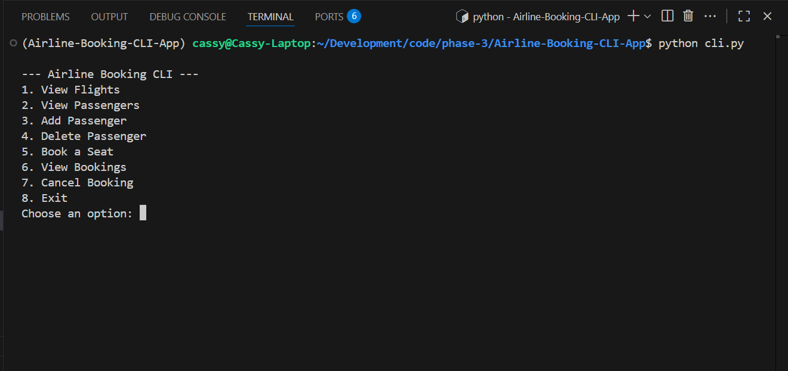

# Phase 3 Final Project – Airline Booking CLI App

A command-line application for managing flights, passengers, and bookings.  
Built with **Python**, **SQLite**, and **SQLAlchemy ORM**, this project simulates an airline booking system where users can add passengers, view available flights, book or cancel seats, and manage records.

By Cassy Omondi


---

## Screenshot



---

## Features

- View all flights, passengers, and bookings
- Add or delete passengers
- Book a seat on a flight
- Cancel existing bookings
- Input validation for safe user interaction
- Data persistence via SQLite and SQLAlchemy ORM
- Simple, menu-driven command-line interface

---

### Repository

Clone the project from GitHub:  
**SSH:** `git@github.com:evansveryown/Airline-Booking-CLI-App.git`  
**HTTPS:** `https://github.com/evansveryown/Airline-Booking-CLI-App.git`

---

## How to Use

### Requirements
- Python 3.9+
- Pipenv (for environment and dependencies)

#### 1. Clone the repository:
```bash
git clone https://github.com/evansveryown/Airline-Booking-CLI-App.git
```

#### 2. Navigate to the project folder:
```bash
cd Airline-Booking-CLI-App
```

#### 3. Install dependencies:
```bash
pipenv install
```

#### 4. Run migrations (set up the database schema):
```bash
pipenv run alembic upgrade head
```

#### 5. Launch the CLI app:
```bash
pipenv run python cli.py
```

#### Example Workflow

- Add Passenger → Enter name and email to create a new passenger.

- View Flights → See available flights with their destinations and seat capacity.

- Book a Seat → Select a flight and passenger to create a booking.

- View Bookings → Display all current bookings.

- Cancel Booking → Remove an existing booking.

- Exit → Safely close the program.

---

# Author

Cassy Omondi

# License

MIT License

Copyright © 2025 Cassy Omondi

Permission is hereby granted, free of charge, to any person obtaining a copy of this software and associated documentation files (the "Software"), to deal in the Software without restriction, including without limitation the rights to use, copy, modify, merge, publish, distribute, sublicense, and/or sell copies of the Software, and to permit persons to whom the Software is furnished to do so, subject to the following conditions:

The above copyright notice and this permission notice shall be included in all copies or substantial portions of the Software.

THE SOFTWARE IS PROVIDED "AS IS", WITHOUT WARRANTY OF ANY KIND, EXPRESS OR IMPLIED, INCLUDING BUT NOT LIMITED TO THE WARRANTIES OF MERCHANTABILITY, FITNESS FOR A PARTICULAR PURPOSE AND NONINFRINGEMENT. IN NO EVENT SHALL THE AUTHORS OR COPYRIGHT HOLDERS BE LIABLE FOR ANY CLAIM, DAMAGES OR OTHER LIABILITY, WHETHER IN AN ACTION OF CONTRACT, TORT OR OTHERWISE, ARISING FROM, OUT OF OR IN CONNECTION WITH THE SOFTWARE OR THE USE OR OTHER DEALINGS IN THE SOFTWARE.